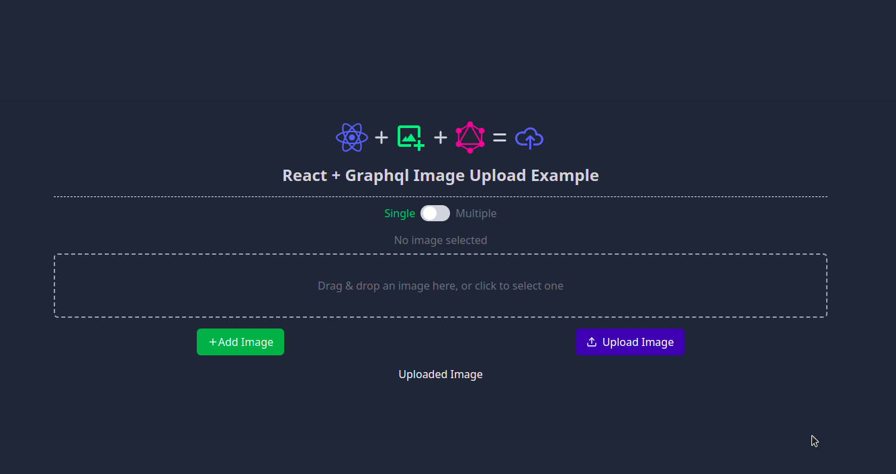

<p align="center">
  <a href="https://github.com/Amit091" target="blank"></a>
</p>

## React Image Upload with GraphQL

<p align="center">
<a href="https://nodejs.org/" target="_blank">
  
</a>
<a href="https://pnpm.io/" target="_blank">
  
</a>
<a href="https://reactjs.org/" target="_blank">
  
</a>
<a href="https://tailwindcss.com/" target="_blank">
  
</a>

</p>

This is a demo project showcasing how to implement image uploads in a React application using TypeScript, Tailwind CSS, and GraphQL.


### Features

- <strong>Single Image Upload</strong>: Upload a single image with a GraphQL API.
- <strong>Multiple Image Upload</strong>: Upload multiple images at once using the same GraphQL API.

### Prerequisites

Before you begin, ensure you have the following installed:

- [Node.js](https://nodejs.org/) (v18 or later)
- [Pnpm](https://pnpm.io/) (v9 or older)
- [NestJS GraphQL Image Upload](https://github.com/Amit091/nestjs-graphql-image-upload.git) (you can set this repo or connect to an existing one)

**Clone the repository:**

```zsh
git clone https://github.com/Amit091/reactjs-graphql-image-upload.git
cd reactjs-graphql-image-upload
```

### Project setup

```zsh
pnpm install
# or
npm install
```

### Setup and run the project

1. Ensure you have the GraphQL backend running.
2. Update graphql types and interfaces
```zsh
pnpm codegen
#or
npm run codegen
```
3. Start the development server

```zsh
pnpm dev
#or
npm run dev
```

4. Open http://localhost:5173 to view the project in the browser.
5. You can now upload images to the GraphQL API.
6. Screenshot
  

## References
This project was developed along with [NestJS GraphQL Image Upload project](https://github.com/Amit091/nestjs-graphql-image-upload.git).

## Stay in touch

- [Amit Dhoju](https://www.facebook.com/amitmaxdhoju)
- [Linkedin](https://www.linkedin.com/in/amitdhoju/)
